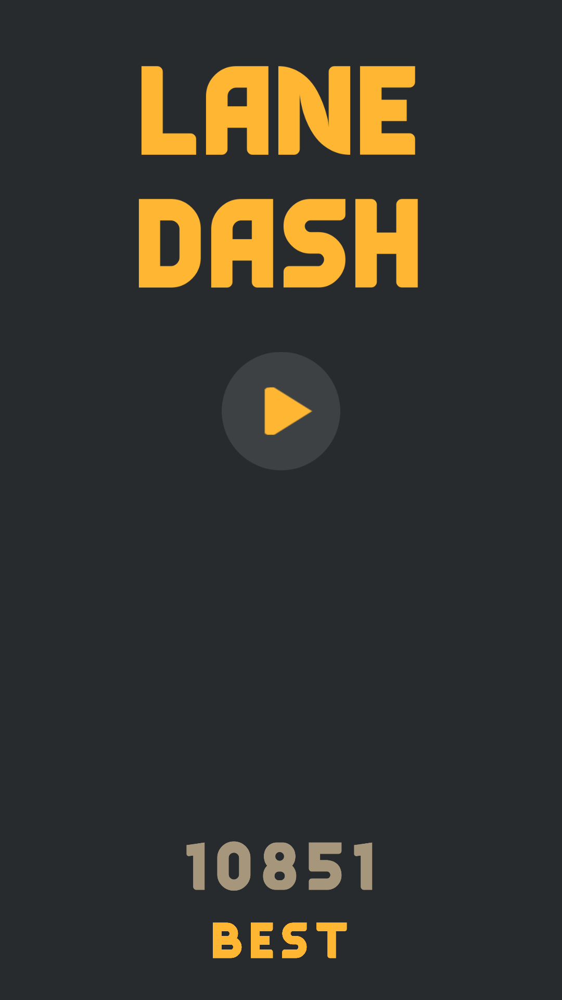
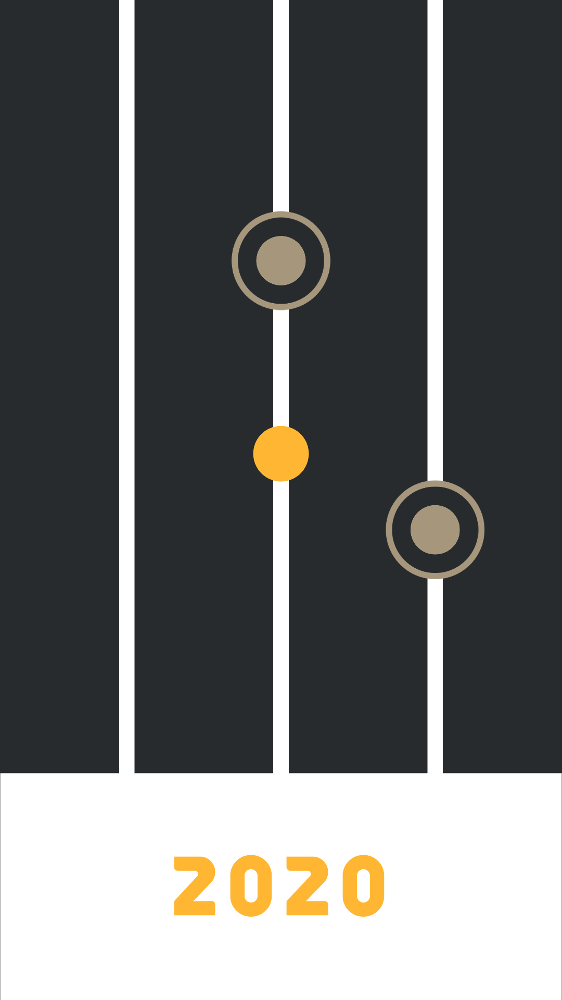

# Lane Dash
LaneDash is a hyper-casual game where you guide a ball to dodge falling obstacles and survive as long as possible! 🎯
Swipe to switch lanes, move left or right between poles and keep the ball safe from objects dropping from the top.

## Screenshots

  
  

## Download
- [:sparkles: Download from Itch.io](https://hieubigby.itch.io/lane-dash)

## Credits
- [Original Project](https://github.com/zerefgd/Orbit)
- Game Engine: [Unity](https://unity3d.com/)
- Thanks to all of the game development community for their awesome help.
